# The Care Loop: Design System

Extracted from the live page at https://thecareloop.app/design-system (Edition II). Source of truth is the home page; this doc mirrors its tokens, type, components and patterns.

Screenshots saved in `screenshots/` alongside this file.

## Hero

Dark mode (default) and light mode.

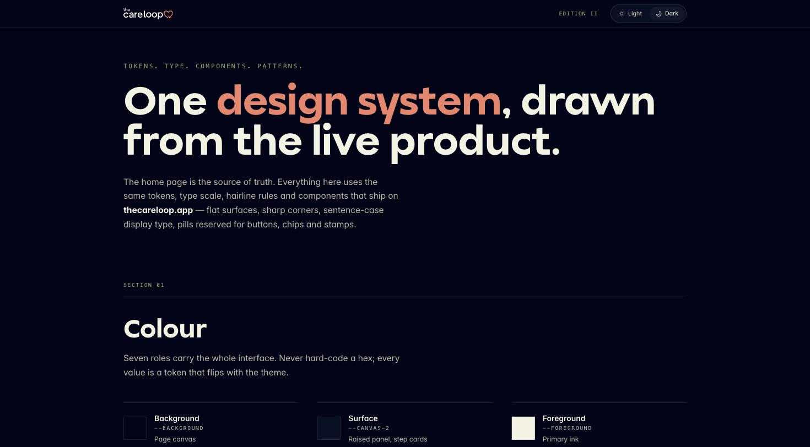
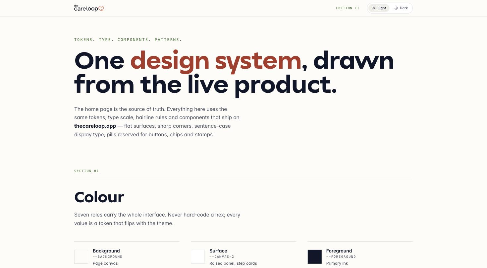

## 01. Colour

Seven roles carry the whole interface. Never hard-code a hex; every value is a CSS custom property that flips with theme class `.light` / default (dark).

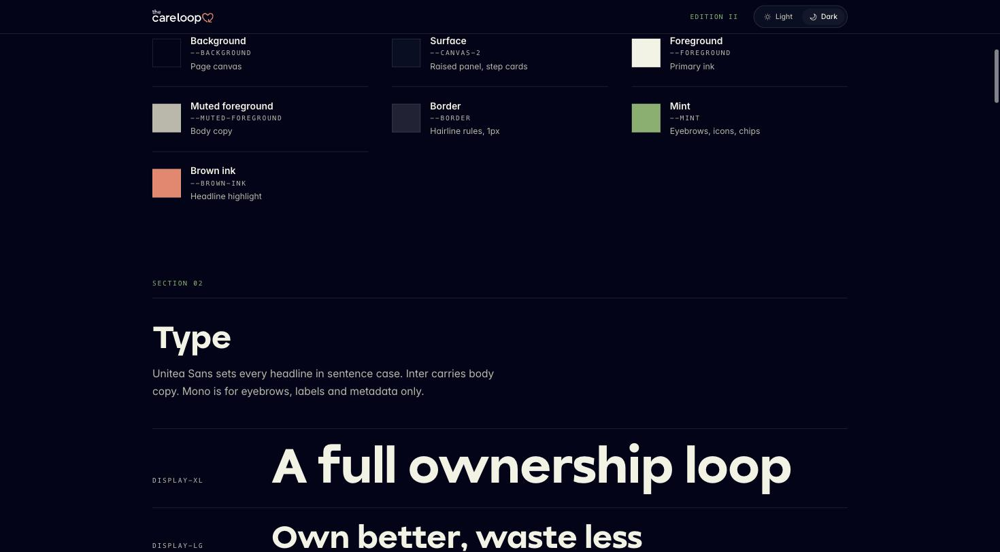

### Semantic tokens (dark, default `:root`)

| Role | Token | Value |
|---|---|---|
| Background | `--background` | `#02041a` |
| Surface / card | `--card` (aliased by `--canvas-2`) | `#090f24` |
| Foreground | `--foreground` | `#f1f2e3` |
| Muted foreground | `--muted-foreground` | `#bab8aa` |
| Border | `--border` | `#ffffff1f` (12% white) |
| Mint (accent, icons, chips) | `--mint` (= `--sage`) | `#80b068` |
| Brown ink (headline highlight) | `--brown-ink` (= `--brown` / `--ochre`) | `#f08169` |
| Primary | `--primary` | `#f1f2e3` |
| Primary foreground | `--primary-foreground` | `#02041a` |
| Secondary / muted surface | `--secondary` / `--muted` | `#11172b` |
| Destructive | `--destructive` | `#cd6766` |
| Input | `--input` | `#ffffff29` |
| Ring | `--ring` | `#f08169` |

### Semantic tokens (`.light`)

| Role | Token | Value |
|---|---|---|
| Background | `--background` | `#fcfcf8` |
| Surface / card | `--card` | `#fff` |
| Foreground | `--foreground` | `#101629` |
| Muted foreground | `--muted-foreground` | `#4c5264` |
| Border | `--border` | `#1016291f` |
| Secondary / muted surface | `--secondary` / `--muted` | `#efefe9` |
| Destructive | `--destructive` | `#c04448` |
| Input | `--input` | `#1016292e` |
| Ring | `--ring` | `#ab3729` |
| Mint (accent) | `--mint` (`--sage` becomes) | `#5b8943` |
| Accent (ochre) | `--accent` (`--ochre`) | `#b16c4c`-ish (`--dim-longevity: #b16c4c`) |

### Raw palette (base colours, dark values from default `:root`)

| Token | Value | Notes |
|---|---|---|
| `--ink` | `#f1f2e3` | cream/ink text |
| `--cream` | `#02041a` | (name is legacy; this is the dark bg) |
| `--paper` | `#090f24` | |
| `--forest` | `#010216` | |
| `--sage` | `#80b068` | mint/green accent |
| `--brown` | `#f08169` | coral/brown accent |
| `--ochre` | `#f08169` | same as brown here |
| `--clay` | `#dc9d81` | |
| `--slate-soft` | `#9198ab` | |
| `--violet-deep` | `#0d142c` | |
| `--plum` | `#547f3f` | |
| `--iris` | `#80b068` | |
| `--violet-soft` | `#c4d9b0` | |
| `--coral` | `#c26f6d` | |
| `--peach` | `#dc9d81` | |
| `--sky` | `#afc798` | |
| `--on-accent` | `#0e1323` | text on accent fill |

### Dimension colours (Trust Score bars, dark)

| Dimension | Token | Value |
|---|---|---|
| Health | `--dim-health` | `#fac131` |
| Planet | `--dim-planet` | `#80b068` |
| Ethics | `--dim-ethics` | `#9397ff` |
| Longevity | `--dim-longevity` | `#dc9d81` |

Light mode: health `#b38400`, planet `#5b8943`, ethics `#6461da`, longevity `#b16c4c`.

### Gradients

```
--gradient-plum: linear-gradient(135deg, var(--violet-deep) 0%, var(--plum) 45%, var(--iris) 100%);
--gradient-coral: linear-gradient(135deg, var(--coral) 0%, var(--peach) 60%, var(--ochre) 100%);
--gradient-sunrise: linear-gradient(135deg, var(--iris) 0%, var(--coral) 50%, var(--ochre) 100%);
--gradient-meadow: linear-gradient(135deg, var(--mint) 0%, var(--sky) 60%, var(--violet-soft) 100%);
```

### Shadows

```
--shadow-soft (dark): 0 1px 2px #00000080, 0 24px 60px -28px #0009;
--shadow-soft (light): 0 1px 2px #1414280f, 0 24px 60px -28px #1414282e;
--shadow-plum: 0 20px 60px -20px var(--iris), 0 8px 24px -12px var(--ink);
```

Rule: never hard-code a hex in product code. Use the token.

## 02. Type

Unitea Sans sets every headline in sentence case. Inter carries body copy. Mono is for eyebrows, labels and metadata only.

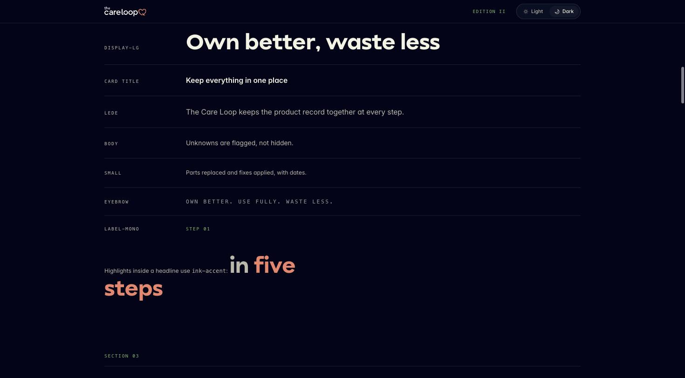

| Family | Token | Stack |
|---|---|---|
| Display | `--font-display` | `"Unitea Sans", "Helvetica Neue", Helvetica, Arial, sans-serif` |
| Body | `--font-sans` (aliased `--font-body`) | `"Inter", "Helvetica Neue", Helvetica, Arial, sans-serif` |
| Mono | `--font-mono` | `"Menlo", "Consolas", ui-monospace, monospace` |

| Scale | Token | CSS shorthand |
|---|---|---|
| Hero | `--text-hero` | `700 96px/.95 var(--font-display)` |
| H1 | `--text-h1` | `700 56px/1 var(--font-display)` |
| H2 | `--text-h2` | `700 32px/1.05 var(--font-display)` |
| H3 (card title) | `--text-h3` | `600 22px/1.15 var(--font-display)` |
| Body small | `--text-body-sm` | `400 12px/1.5 var(--font-sans)` |

Named specimens on the page: DISPLAY-XL, DISPLAY-LG, CARD TITLE, LEDE, BODY, SMALL, EYEBROW (uppercase mono, tracked), LABEL-MONO (uppercase mono).

Headline highlight pattern: wrap the emphasized span in an `ink-accent` class, colored with `--brown-ink`. Example: "in **five steps**".

## 03. Brand marks

Wordmark is the default lockup ("the careloop" + heart glyph). The heart mark alone takes over wherever the wordmark stops being readable (small favicons, app icons, tight spaces).

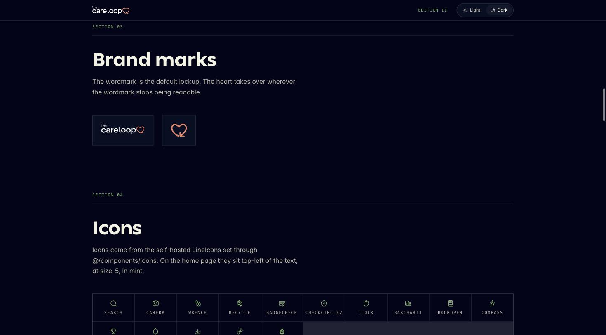

## 04. Icons

Self-hosted LineIcons set, imported through `@/components/icons`. On the home page they sit top-left of the text, at `size-5`, colored mint (`--mint`).

Icons shown in the system: Search, Camera, Wrench, Recycle, BadgeCheck, CheckCircle2, Clock, BarChart3, BookOpen, Compass, Award, BellRing, Download, ExternalLink, Sparkles.

## 05. Actions

One pill button (`--radius-pill: 999px`) carries every primary action on the site. Everything else is a chip, a link with an arrow, or a quiet outline.

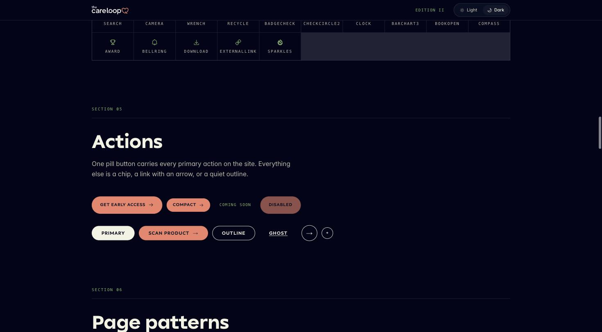

Variants seen:
- **Primary pill** (filled, coral/`--brown-ink` bg): "GET EARLY ACCESS →"
- **Compact pill**: smaller padding, same fill, "COMPACT →"
- **Coming soon**: text only, muted, no fill (disabled-looking label state)
- **Disabled pill**: filled but dimmed
- **Primary (inverted)**: light-fill pill button, dark text, no arrow. Label: "PRIMARY"
- **Scan product**: pill with trailing arrow icon, coral fill
- **Outline**: hairline border, transparent fill, sharp corners (not pill). Label: "OUTLINE"
- **Ghost**: text link, underline on state. Label: "GHOST"
- **Icon-only circle buttons**: arrow (→) and plus (+) in a bordered circle

Radius rule: `--radius: 0rem` everywhere except pills/chips/stamps, which use `--radius-pill: 999px`. Sharp corners are the system default; pill shape is reserved.

## 06. Page patterns

Three layouts do most of the work on the home page.

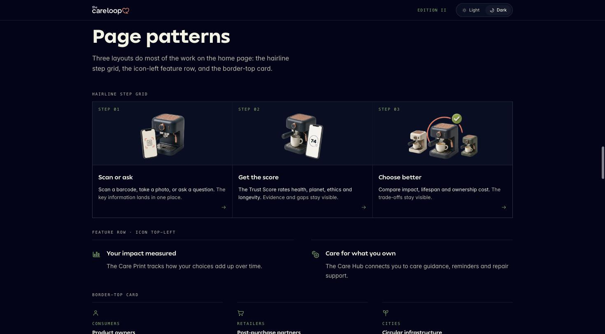

1. **Hairline step grid**: 3-column grid, 1px hairline dividers, each cell: mono `STEP 0N` label, product photo/illustration, bold title, body copy, trailing arrow link.
2. **Feature row, icon top-left**: icon (mint, size-5) sits above/left of a bold title and one line of body copy. Two-column layout on desktop.
3. **Border-top card**: card has a 1px top border only (no full box), mono eyebrow label (audience name), bold title, body copy. Used for the consumers/retailers/cities trio.

## 07. Display components

Badges, tags, index rows and panels used inside the product.

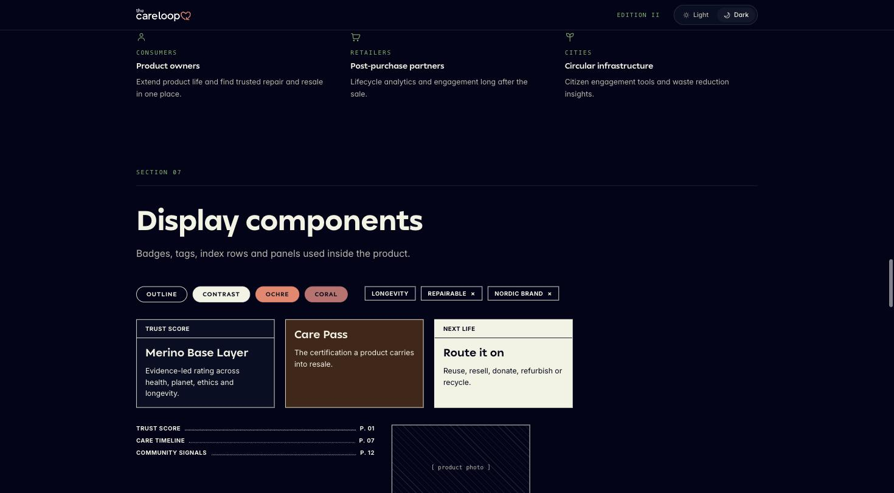

- **Badges/tags**: `OUTLINE` (hairline), `CONTRAST` (filled dark), `OCHRE` (filled coral), `CORAL` (filled muted rose). Pill-shaped, mono/uppercase label.
- **Removable chips**: rounded rect with trailing `×`, e.g. `LONGEVITY`, `REPAIRABLE ×`, `NORDIC BRAND ×`.
- **Panel card**: mono eyebrow (`TRUST SCORE`), bold `--text-h3` title, body copy. Three fill variants shown: default surface, accent-filled (coral/ochre), and inverse (cream fill, dark text).
- **Index row**: dotted leader line between a label and a page number, mono type, e.g. `TRUST SCORE ..... P. 01`.
- **Photo placeholder**: hairline-bordered box with diagonal hatch fill and centered `[ product photo ]` mono label. Used wherever real imagery isn't in the system yet.

## 08. Trust Score

The headline result of a product evaluation, plus the evidence behind it. This is the most complex composite component.

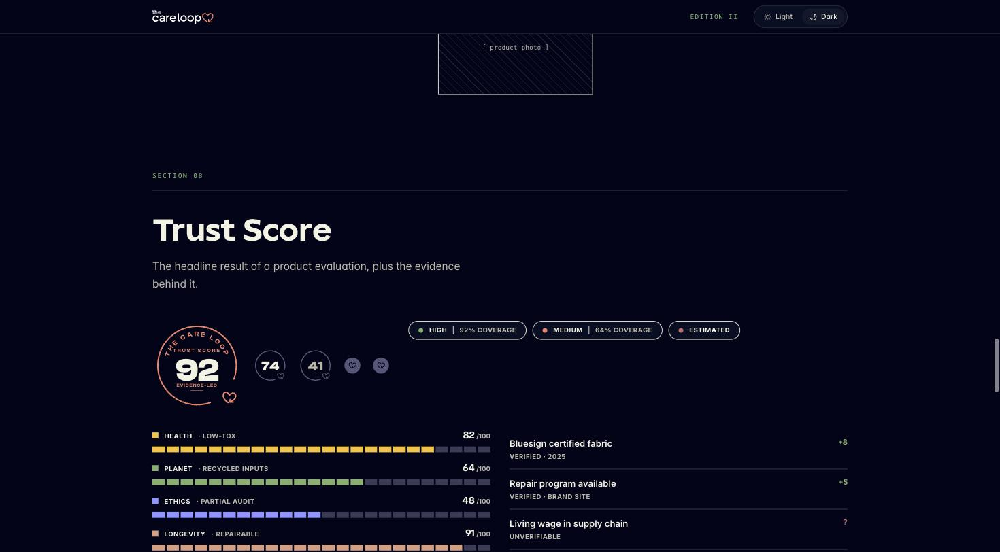

Anatomy:
- **Score ring**: circular badge, wordmark + "TRUST SCORE" arced text, big numeral (e.g. `92`), `EVIDENCE-LED` mono caption, small heart glyph at bottom.
- **Comparison chips**: smaller numeral badges (`74`, `41`) plus heart-outline icons, for side-by-side scores.
- **Confidence legend**: three pill badges with colored dot + label. Examples: `HIGH · 92% COVERAGE`, `MEDIUM · 64% COVERAGE`, `ESTIMATED`. Dot colors map to confidence, not to the dimension colors.
- **Dimension bars**: label row (colored square swatch + dimension name + descriptor, e.g. `HEALTH · LOW-TOX`) with numeric score right-aligned (`82/100`), then a segmented horizontal bar (filled segments = score, using the dimension's colour token from `--dim-*`).
- **Evidence list**: right column, each row = claim title, mono provenance caption (`VERIFIED · 2025`, `UNVERIFIABLE`, `VERIFIED · LOGISTICS`), and a signed point delta (`+8`, `+5`, `-6`) or `?` for unverifiable.

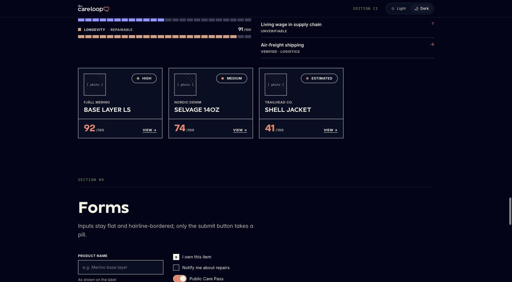

- **Product result cards**: photo placeholder, confidence badge (HIGH/MEDIUM/ESTIMATED dot pill), brand mono label, bold product name, big score numeral + `/100`, trailing `VIEW →` link. Three examples: Fjäll Merino Base Layer LS (92, HIGH), Nordic Denim Selvage 14oz (74, MEDIUM), Trailhead Co. Shell Jacket (41, ESTIMATED).

## 09. Forms

Inputs stay flat and hairline-bordered; only the submit button takes a pill.

- **Text input**: label above (bold, small caps-ish), hairline border box, placeholder in muted, helper text below in small muted type. Example: `PRODUCT NAME` / "As shown on the label".
- **Validated input**: same shape, border tinted coral/destructive on invalid state (barcode field: `Enter a valid EAN-13`).
- **Select**: hairline box with trailing chevron/arrow glyph, label above (`NEXT-LIFE ROUTE`).
- **Checkbox**: square, filled/checked with `×`-style mark when off? (shown: unchecked outline box, checked = filled with mark).
- **Toggle switch**: pill track, coral when on.
- **Radio group**: circular, filled dot when selected (`Clean` selected among Clean / Store / Rotate / Service).

## 10. Navigation and feedback

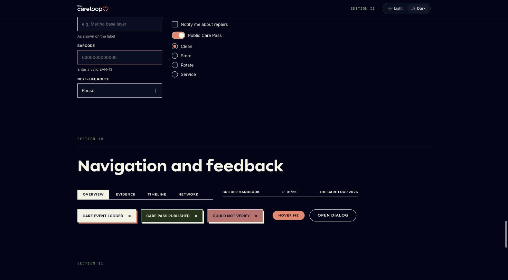

- **Tab bar**: mono uppercase labels, underline on active tab (`OVERVIEW` active vs `EVIDENCE`, `TIMELINE`, `NETWORK`).
- **Breadcrumb-ish meta row**: `BUILDER HANDBOOK · P. 01/25 · THE CARE LOOP 2026`. Plain mono text, no chrome.
- **Toast/status chips**: pill, colored by outcome, trailing `×` to dismiss. Examples: `CARE EVENT LOGGED` (coral/neutral), `CARE PASS PUBLISHED` (green/success), `COULD NOT VERIFY` (rose/error).
- **Hover/dialog triggers**: `HOVER ME` (pill) and `OPEN DIALOG` (outline pill) as interaction demos.

## 11. AI patterns

AI is an assistant to judgement, not a replacement for it. Every generated surface follows the same five rules.

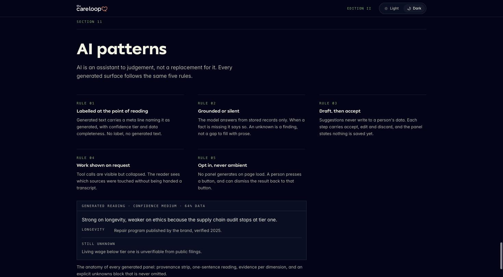

1. **Labelled at the point of reading**: generated text carries a meta line naming it as generated, with confidence tier and data completeness. No label, no generated text.
2. **Grounded or silent**: the model answers from stored records only. When a fact is missing it says so. An unknown is a finding, not a gap to fill with prose.
3. **Draft, then accept**: suggestions never write to a person's data. Each step carries accept, edit and discard; the panel states nothing is saved yet.
4. **Work shown on request**: tool calls are visible but collapsed. The reader sees which sources were touched without being handed a transcript.
5. **Opt in, never ambient**: no panel generates on page load. A person presses a button, and can dismiss the result back to that button.

**Generated panel anatomy** (provenance strip → one-sentence reading → evidence per dimension → explicit unknowns block, always present, never omitted):

- Header strip: `GENERATED READING · CONFIDENCE MEDIUM · 64% DATA` (mono, hairline bottom border).
- One-sentence reading in body type: "Strong on longevity, weaker on ethics because the supply chain audit stops at tier one."
- Evidence row per dimension: mono dimension label + one-line source note.
- `STILL UNKNOWN` block: mono label + plain-language gap statement, e.g. "Living wage below tier one is unverifiable from public filings."

## Core primitives reference

```
--radius: 0rem;          /* sharp corners, system default */
--radius-pill: 999px;    /* buttons, chips, stamps only */
--border-w: 1px;         /* all hairline rules */
--rule: 1px solid var(--ink);
--offset-shadow: 4px 4px 0 var(--ink);
--ease-out: cubic-bezier(.2, .6, .2, 1);
--dur-fast: .14s;
```

## Notes for implementation

- Every colour is a CSS custom property; never hard-code a hex in component code.
- Dark is the default theme (`:root`); `.light` class overrides the same token names.
- Display headings are always sentence case, never uppercase (uppercase mono is reserved for eyebrows/labels/metadata).
- Pills are reserved for buttons, chips and stamps; everything else is sharp-cornered.
