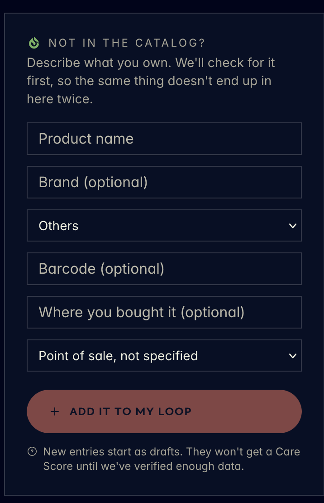
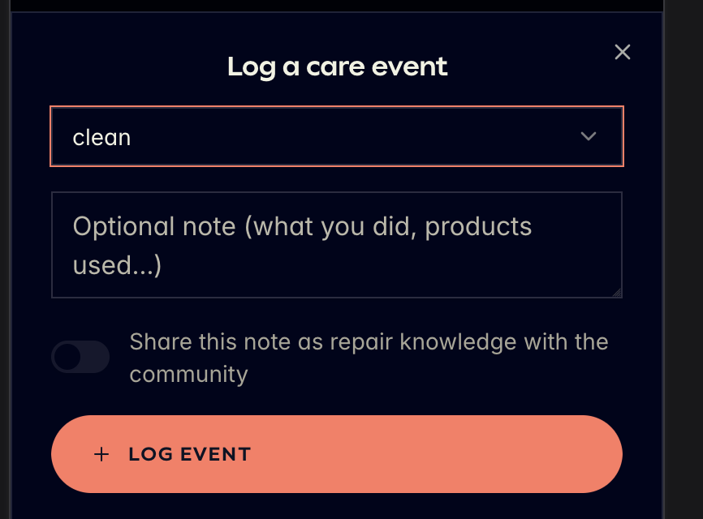
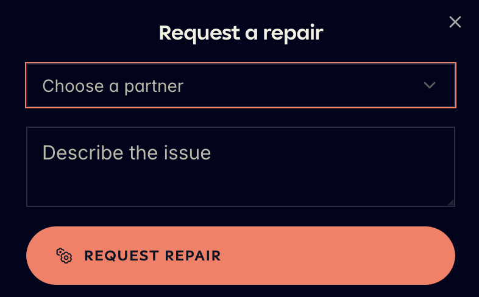
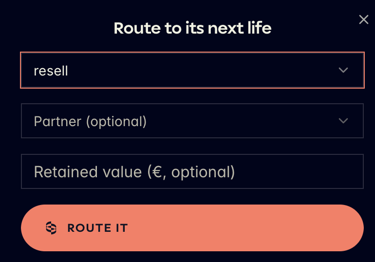
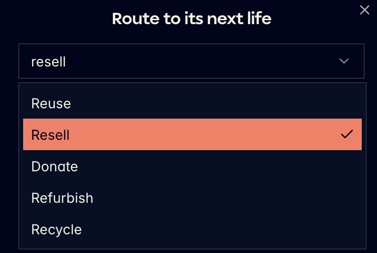
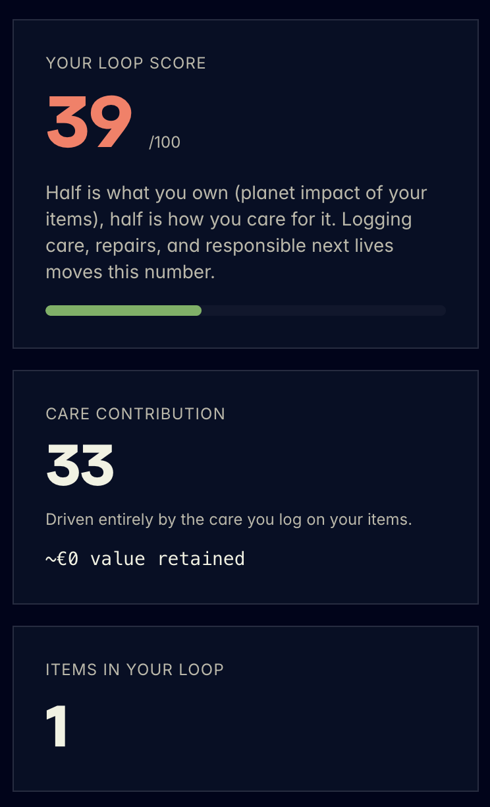
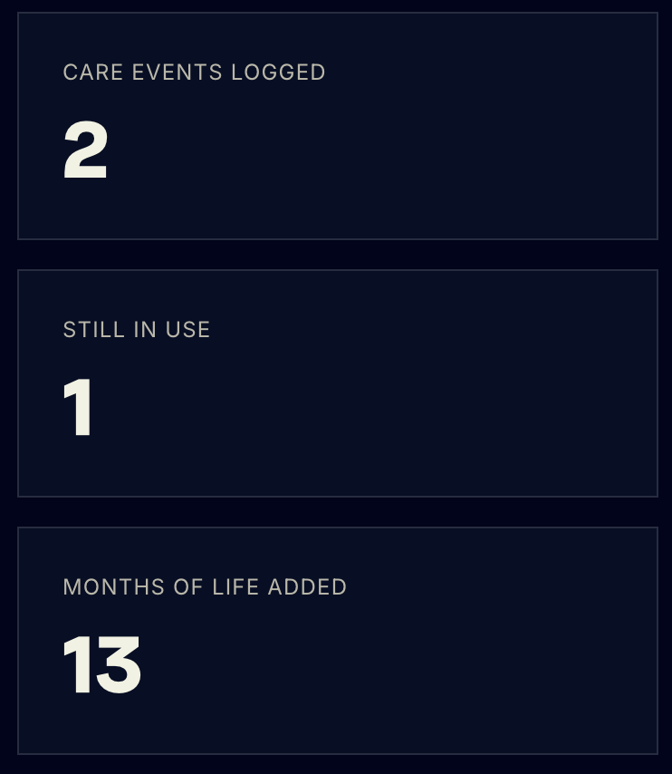

# Spec: Home Tab — Capture (Scan/Log) + Home Screen

## Problem Statement

A CareLoop owner has no reason to open the app between the rare moments something breaks. The brief (`docs/challenge/02-careloop-brief.md`) identifies the "use fully" phase as the hard part of the ownership loop: people forget maintenance, miss early signs of problems, postpone repairs, and lose track of warranties and receipts. Existing product information is scattered across receipts, memory, and disconnected apps, so owners default to ignoring care until something goes wrong — at which point the product may already be past saving.

From the owner's perspective: "I own things I'd like to keep working longer, but I have no easy way to record what I've done for them, know what to do next, or see that any of it is paying off."

This spec assumes the app shell already exists (`01-scaffolding.md`: sign-in, bottom tab bar, `services/api` seam) and specifies what a shopper actually does once inside it: capture a product (scan or log), and see the payoff on Home.

## Solution

Building on the scaffold, this spec adds:

- Capture a product into the Ownership Log from anywhere in the app, via a floating action button offering two choices: Scan or Log.
- Scan identifies a product — live camera, a photo from the gallery, a single manual-entry field, or a full manual-product-entry form for anything not in the catalog.
- Log lets an owner search their existing products and take one of three actions against one: log a care event, request a repair, or route it to its next life.
- Home is the tab a shopper lands on: a short backend-driven events carousel, plus a Care Score and a handful of supporting counts that make the payoff of logging visible, without turning the screen into a dashboard.

Reference images (style/layout reference only, from a competitor app — not literal feature parity) are stored in `specs/assets/`.

**Manual product entry** (Scan's third sub-tab, not-in-catalog fallback):

**Log flow's three sub-tab forms** — Log care, Find repair, Next life (with its route dropdown open):

**Home stats section** — Care Score/contribution cards, and the supporting count tiles:

## User Stories

1. As a shopper, I want a single floating action button reachable from anywhere in the main shell, so that I can start capturing a product or logging an action without hunting for the right screen first.
2. As a shopper, I want the floating action to offer exactly two choices — Scan and Log — so that I'm never more than one tap from either of the app's two core actions.
3. As a shopper, I want to scan a product with my camera, so that I can identify it without typing anything.
4. As a shopper, I want to upload a photo of a barcode or product from my gallery instead of using the live camera, so that I can identify a product from a photo I already have (or when I can't point my camera at the item directly).
5. As a shopper, I want a manual-entry option with a single input field, so that I can identify a product by barcode or code when the camera can't read it.
6. As a shopper, I want to describe a product that isn't in the catalog (name, brand, category, barcode, point of sale), so that it still ends up in my loop even if CareLoop doesn't recognize it yet.
7. As a shopper, I want to see a clear signal that a manually-entered product starts as a draft with no Care Score until verified, so that I understand why its number might be missing or low.
8. As a shopper, I want to search my owned products by name, so that I can find the one I want to act on quickly.
9. As a shopper, I want to select a product and see three clear actions — Log care, Find repair, Next life — so that I know exactly what I can do with something I own.
10. As a shopper, I want to log a care event (type, optional note) against a product, so that my care history is recorded.
11. As a shopper, I want to opt in to sharing a care note as community repair knowledge, so that my experience can help someone else, without that being the default.
12. As a shopper, I want to request a repair by choosing a partner and describing the issue, so that I can get help without leaving the app.
13. As a shopper, I want to route a product to its next life (reuse, resell, donate, refurbish, recycle), optionally naming a partner and a retained value, so that its end-of-ownership outcome is recorded honestly.
14. As a shopper, I want every care event, repair request, and next-life routing I complete to update my Ownership Log, so that the log reflects everything I've actually done.
15. As a shopper landing on Home, I want to see a short carousel of events sourced from the backend, so that I notice what's currently relevant without seeking it out.
16. As a shopper, I want to see my personal Care Score out of 100 with a one-line explanation, so that I understand at a glance how I'm doing across everything I own.
17. As a shopper, I want to see a secondary breakdown of my care-driven contribution to that score, so that I understand what part of the number is within my direct control.
18. As a shopper, I want to see a small set of supporting counts (care events logged, items still in use, months of life added, items in my loop), so that I have concrete, glanceable evidence that my effort is paying off.
19. As a shopper, I want Home to stay to two content sections plus the floating action, so that the screen never feels like a dense dashboard.

## Implementation Decisions

- **Test seam.** Uses the single `services/api`-style module introduced in `01-scaffolding.md` — no new seam. This spec is the first to give it real calls: events list, score/stats summary, product search/list, and Ownership Log writes (log care, find repair, next life).
- **No automated tests** for this project (sprint demo, not production code) — see `CLAUDE.md`.
- **Floating action button**: global `+` button, bottom-right, opens a two-option sheet (Scan, Log). Default assumption: visible on all four tabs, not just Home — flagged as an open question for build-time confirmation.
- **Scan flow**: 3 sub-tabs (Camera scan / Manual entry / Manual product entry), reusing the design system's mono-uppercase underlined tab-bar pattern. Manual product entry form fields, per `assets/manual-product-entry-reference.png`: product name (required), brand (optional), category (select, default "Others"), barcode (optional), point of sale (text + select, both optional), submit pill "+ Add it to my loop", helper copy noting draft status.
- **Camera scan sub-tab gets a second entry point: upload from gallery.** A small icon/button on the camera viewfinder opens the device photo picker; the chosen image runs through the same barcode/product recognition path as a live camera frame, landing on the same result (matched product, or the manual-product-entry fallback if unrecognized). One recognition path, two capture sources — no separate sub-tab, no separate result screen. This is the same capture component `05-verify-tab.md` reuses for Care Pass lookups.
- **Log flow**: product list (search input pinned to top) → product detail with 3 sub-tabs (Log care / Find repair / Next life), each a short form ending in one primary pill button. Fields per reference images: **Log care** (`assets/log-care-event-reference.png`) — care event type select (e.g. clean/store/rotate/service), optional note textarea, "share as repair knowledge" toggle, pill "+ Log event". **Find repair** (`assets/find-repair-reference.png`) — choose-a-partner select, describe-the-issue textarea, pill "Request repair". **Next life** (`assets/next-life-route-reference.png`, dropdown state in `assets/next-life-route-dropdown-reference.png`) — route select (Reuse / Resell / Donate / Refurbish / Recycle), partner select (optional), retained value in € (optional), pill "Route it".
- **Home screen composition**: events carousel (top, horizontal scroll, backend-sourced, collapses when empty) → stats section (primary Care Score card with progress bar + secondary care-contribution card + 3–4 supporting count tiles), per `assets/home-stats-score-reference.png` (score + care contribution) and `assets/home-stats-counts-reference.png` (care events logged, still in use, months of life added).
- **Terminology discipline**: the personal Home-screen score is named "Care Score," distinct from the per-product "Trust Score" defined in `docs/challenge/03-careloop-glossary.md` — a rollup across everything owned is a different concept from a single product's evaluation, and copy must not blur the two.
- **Design system usage**: inherits the baseline from `01-scaffolding.md`. Care Score numeral and progress fill get the one accent color (coral/`--brown-ink`); stat and score cards stay sharp-cornered (radius 0); flat hairline-bordered form inputs throughout Scan and Log.

## Testing Decisions

None. Per project convention (`CLAUDE.md`): no automated tests for this project — it's a sprint demo, not production code. The single data-access seam described above is a structural decision for keeping mock/real data swappable, not a test boundary.

## Out of Scope

- Sign-in, role selection, bottom tab bar, and the base `services/api` seam — see `01-scaffolding.md`.
- Discounts, Epassi, and Verify tab content — see `03-discounts-tab.md`, `04-epassi-tab.md`, `05-verify-tab.md`.
- Dedicated service-provider screens (job queue, incoming repair requests).
- Event-card tap destination (event detail screen) — event taxonomy isn't defined yet.
- Notifications, streaks, or any gamification beyond the static counts already on Home (brainstorming ideas 1 and 2 in `docs/brainstorming.md`).
- Publishing this spec to an external issue tracker — none is configured for this repo; specs stay as local markdown under `specs/`.

## Further Notes

- Depends on `01-scaffolding.md` for the app shell, navigation, and the `services/api` seam this spec extends.
- `03-discounts-tab.md` and `04-epassi-tab.md` reuse this spec's Ownership Log write (story 14) as the source of their unlock-progress counts. `05-verify-tab.md` reuses this spec's Scan capture component (stories 3, 4, 5) wholesale for its own lookup flow.
- Two build-time open questions: (1) whether the FAB is global or Home-only, (2) whether the Care Score is computed live or batch, which affects whether Home needs a loading/stale state.
- `ready-for-agent` in the frontmatter is a status marker only — there's no tracker workflow behind it to enforce that state machine. Treat it as "this doc is specified enough to hand to a build agent," not as a ticket state.
