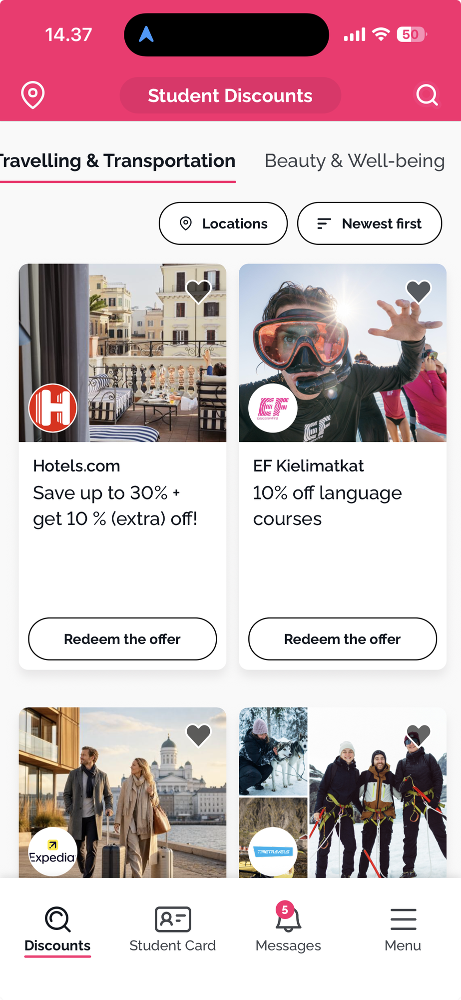
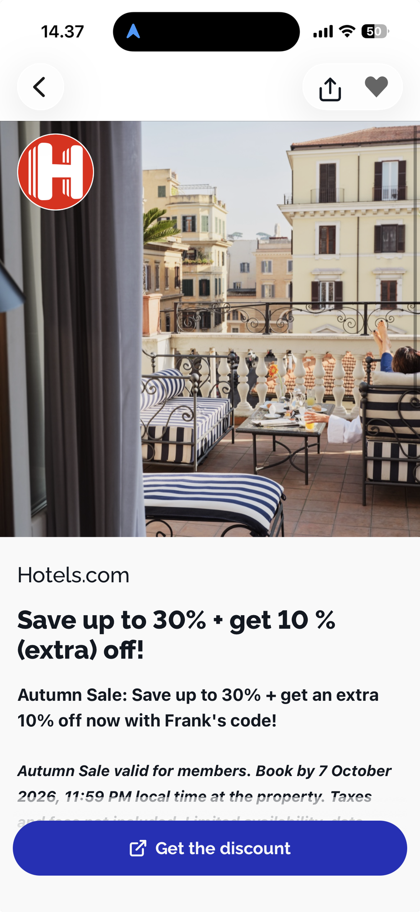

# Spec: Discounts Tab — Offered Discounts List + Detail

## Problem Statement

A CareLoop owner who is actually logging care (per `02-home-tab.md`) has no way to see that the habit pays off beyond a Care Score number. The Discounts tab exists in the bottom nav (`01-scaffolding.md`, story 3) but its content is unspecified — right now it's a stub. Owners need a concrete, visible reward tied to the logging behavior the rest of the app is asking them to build, or logging stays an abstract virtue with no payoff.

From the owner's perspective: "I keep logging care for things I own. Show me what that's actually earning me, and how close I am to earning more."

## Solution

A Discounts tab, read-only from the consumer side, that lists discounts offered by four kinds of external actors: Brands, Service providers, Retailers, and Cities. Each actor defines its own unlock rule elsewhere (a portal not built in this sprint): log N times per day/week/month/year to unlock their discount. The consumer app:

- Shows every offered discount, grouped by actor type, whether or not the owner has unlocked it yet.
- Shows a small progress bar on each discount card: how many logs the owner has made in the current period, against that discount's own threshold.
- Locks the discount's call-to-action until the threshold is met, so the owner always knows exactly what's blocking a reward and by how much.
- Lets the owner open a discount's detail page for the full offer copy and terms, with the same progress/lock treatment carried through.

This spec covers only the consumer-facing list and detail screens. The portals where Brands, Service providers, Retailers, and Cities define their own unlock rules and discount content are out of scope (see Out of Scope).

Reference images (style/layout reference only — a competitor app, not literal feature parity) are stored in `specs/assets/`: `discount-list-reference.png`, `discount-detail-reference.png`. This is the first spec to use `specs/assets/` — the folder is a new convention so future specs have a place to put their own reference images.

## User Stories

1. As a shopper, I want to open the Discounts tab and see discounts grouped by who's offering them, so that I can find offers from the kind of actor I care about (a Brand, a Service provider, a Retailer, or a City).
2. As a shopper, I want a single row of category tabs at the top of Discounts — Brand / Service provider / Retailer / City — so that switching between actor types is one tap.
3. As a shopper, I want to see every discount an actor type offers, not just the ones I've already unlocked, so that I know what's available and what to work toward.
4. As a shopper, I want each discount card to show a small progress bar, so that I can tell at a glance how close I am to unlocking it.
5. As a shopper, I want the progress bar to reflect my logs in the discount's own current period (day, week, month, or year, whichever that discount uses), so that the number means what the offer actually requires.
6. As a shopper, I want a discount I haven't unlocked yet to show a locked, disabled call-to-action instead of an active redeem button, so that I don't try to claim something I haven't earned.
7. As a shopper, I want the locked call-to-action to tell me how many more logs I need, so that I know exactly what to do next.
8. As a shopper, I want a discount I've unlocked to show an active call-to-action, so that I can act on it immediately.
9. As a shopper, I want to tap a discount card and land on its detail page, so that I can read the full offer before acting.
10. As a shopper, I want the detail page to show the actor's logo/name, a hero image, the offer headline, and the full description/terms, so that I understand exactly what I'm getting and any conditions attached.
11. As a shopper, I want the detail page to repeat the same progress bar and locked/unlocked state as the card, so that the detail page is never inconsistent with what I saw on the list.
12. As a shopper, I want a back action and a share action on the detail page, so that I can return to the list or send the offer to someone else.
13. As a shopper, I want the detail page's primary action to read "Get the discount" once unlocked, so that it's clear this is the terminal action for a redeemed offer.
14. As a shopper, I want discounts I've already unlocked to stay visible and clearly marked as unlocked, not disappear from the list, so that I can still find and use them later.
15. As a user, I want the Discounts tab to follow the CareLoop design system (dark theme, one accent color, pill buttons, sharp-cornered cards, mono-uppercase tab labels), so that it feels like the same app as Home.

## Implementation Decisions

- **Actors, not app roles.** Brand, Service provider, Retailer, City are discount-offering entities, each with their own (unbuilt) portal for defining unlock rules and offer content — distinct from the app's own Shopper/Service-provider sign-in roles in `01-scaffolding.md`. A "Service provider" discount actor may overlap with a repair partner referenced in the Log flow's Find Repair sub-tab, but that overlap isn't modeled or enforced in this spec.
- **Unlock rule shape (read-only in this app):** each discount carries a threshold — a log count and a period (`day` / `week` / `month` / `year`). This rule is authored on the actor's own portal, not in this app; the consumer app only reads and evaluates it.
- **Progress numerator — confirmed with user: any log counts, uncoupled from the actor.** A discount's progress bar counts every Ownership Log entry the owner made in that discount's current period window (any care event, repair request, or next-life routing per `02-home-tab.md` story 14) — not logs tied specifically to that Brand/Retailer/City/Service provider's products. Two discounts with different periods (e.g. one weekly, one monthly) each independently window the same underlying log count to their own period; the numerator is the same log stream, just clipped to each discount's own window.
- **Period reset:** the window for a `day`/`week`/`month`/`year` threshold rolls over at that period's boundary; progress resets to the owner's log count in the new window. No streak or carryover across periods.
- **Locked state — confirmed with user: stays visible, not hidden.** A discount below threshold still appears in its actor-type tab with its progress bar drawn (even at zero), and its call-to-action is rendered disabled/locked with copy stating how many more logs are needed (e.g. "Log 3 more to unlock"), on both card and detail page.
- **Unlocked state:** once the current-period log count meets or exceeds the threshold, the card and detail page switch to an active call-to-action ("Redeem the offer" on the card per the reference list image, "Get the discount" on the detail page per the reference detail image) and the progress bar renders full.
- **List screen scope — confirmed with user: one row of category tabs, nothing else.** Tabs are the four actor types (Brand / Service provider / Retailer / City), reusing the design system's mono-uppercase underlined tab-bar pattern (`docs/design-system/design-system.md`, "Tab bar" component). No location filter chip and no sort chip from the reference image — this app doesn't have location or freshness data to back them yet.
- **No favoriting — confirmed with user.** No heart icon on cards or detail page, no saved/wishlist state. The reference images' heart icons are not carried over.
- **Detail page layout:** hero image with the actor's logo overlaid top-left (per reference image), back and share icons top of screen (no heart), actor name, headline, description/terms copy, progress bar + locked/unlocked messaging, primary pill call-to-action pinned near the bottom.
- **Test seam:** extend the existing single `services/api`-style module from `01-scaffolding.md` — no new seam. Add: discounts list (by actor type), discount detail by id, and a way to read the owner's current-period log count (this may already exist as part of the stats/score data the Home screen consumes; reuse rather than duplicate the counting logic).
- **Design system usage:** dark background, coral/`--brown-ink` accent on progress-bar fill and the primary pill CTA (consistent with the Care Score progress bar's treatment in `02-home-tab.md`); sharp corners on cards (radius 0), pill radius only on the CTA button and the actor-type tab underline treatment; mono-uppercase for tab labels and any small eyebrow text (e.g. "3 MORE LOGS TO UNLOCK").
- **Terminology discipline:** call these "discounts," never "coupons" or "codes" — and never call the unlock count a "score," to keep it distinct from Care Score and Trust Score (`docs/challenge/03-careloop-glossary.md`).

## Testing Decisions

None. Per project convention (`CLAUDE.md`): no automated tests for this project — it's a sprint demo, not production code. The `services/api` seam extension described above is for structural clarity (mock/real data swap), not a test boundary.

## Out of Scope

- The Brand / Service provider / Retailer / City portals where these actors define their own unlock thresholds and discount content — those are separate, unbuilt products, not part of this consumer app.
- Location filter and sort chip from the reference list image — no backing data for either in this app.
- Favoriting/wishlist (heart icon) on cards or detail page.
- Actual redemption mechanics behind "Get the discount" / "Redeem the offer" (e.g. a real coupon code, an external checkout handoff) — this spec covers the button's locked/unlocked state and label only, not what happens after tapping it.
- Per-actor or per-product attribution of logs (e.g. "only logs on Brand X's own products count toward Brand X's discount") — explicitly not modeled; every discount counts the owner's total log activity in its own period window.
- Notifications or any alert when a discount newly unlocks.
- Publishing this spec to an external issue tracker — none is configured for this repo, consistent with `01-scaffolding.md`.

## Further Notes

- This spec depends on `01-scaffolding.md` for the app shell, bottom tab bar, and the `services/api` seam it introduces, and on `02-home-tab.md` story 14 for what counts as a loggable Ownership Log entry. It doesn't modify either spec, only fills in the Discounts tab content both explicitly left as a stub.
- `specs/assets/` is a new convention introduced by this spec: a shared place for reference images cited by any spec in this repo, so future specs don't need to invent their own location or reach into `assets/` (which holds the challenge/brief source material, not spec-specific references).
- Open question carried forward for build time: whether tapping a locked call-to-action should do nothing, or surface a short explanation (e.g. a toast repeating "3 more logs to unlock") — not decided in this pass.
